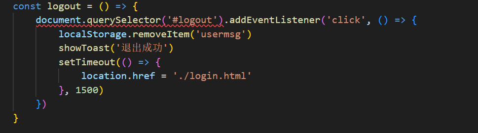

# ReadMe

实现数据登录平台

总共有四个模块——注册，登录，主页面，学生列表

数据接口：https://dy1xx2jpxw.apifox.cn/doc-2226933

# 公共逻辑

基地址：接口文档中接口的url有**公共的前缀**，通过设置基地址在axios请求时可以**简化**url

弹窗：在注册/登录页面成功/失败时会有相应的弹窗弹出提示，在页面的html结果中已经写好了弹窗，在公共逻辑中实现**弹出弹窗功能**，接受过字符串作为弹窗内容

检查token：页面的内容是隐私，只有有token时才能访问，**token放在本地存储中和用户名一起使用对象包裹**，因此取出后先转换为对象，注意要**先检查本地存储是否存在**，如果token不存在则弹窗提示然后**返回登录页**

渲染用户名：登陆后主页要回显用户名

退出按钮：主页和学生列表页中都有退出按钮，给退出按钮绑定点击事件，退出时清除本地存储，弹窗提示然后跳转

设置请求拦截器：对数据接口的访问需要带有token

可以在发送请求之间用**拦截器**将token参数添加到请求中简化axios请求

响应拦截器：对**返回的响应进行解构**可以简化对axios结构的解构，当token失效时会返回401**此时应该删除本地存储然后回到登录页**，可以**用响应拦截器先进行判断**，这样在之后的axios请求就不需要每次都判断了。

# 注册

对提交按钮绑定点击事件，获取到表单内容后做简单的判断然后提交到后端，最后弹窗提示然后跳转页面

# 登录

对提交按钮绑定点击事件，抽取表单内容然后提交，如果提交成功接口会返回用户名和token将这两个值放到本地存储，然后弹窗提醒并跳转到主页，如果失败弹窗提醒

# 主页

先调用公共逻辑：退出按钮，检查token，回显用户名

请求到后端的数据然后一个个渲染图表

总览图的**html结构的类名**与接口数据返回的**键**一致

对数组map访问修改html结构

年份走势图的渲染使用echart折线图库塞到盒子中

线条渐变色设置的**linestyle**属性，面积图渐变色设置**areastyle**属性

分布图类似操作

中国地图，需要先引入china.js文件，初始时是每个省份的数据都为0

接口返回的数据中只有一部分省份，使用双重循环修改初始数据

要得到最大值省份比重中的**const mx = Math.max(...dataList.map(item => item.value))**，然后修改颜色比重

# 学生

调用公共逻辑，然后实现渲染函数，请求数据后修改html结构

**添加和编辑信息用的都是一个弹窗，所以需要对弹窗添加一些表示值用以区分请求**

对添加绑定事件，调用弹窗，**同时将弹窗的title设置为添加学院，一是为了区分，而是为了重置**

对弹窗做初始化，省份城市地区之类的。

首先**获取省份列表填充到选择框中**，但**这里是+=而不是=**，防止默认选择省份。当省份修改了之后**先重置城市列表获取对应的城市列表**，城市修改了之后**先重置地区然后获取地区列表**。

编辑功能中重要的是**回显数据**，下拉列表需要**先有值然后才能选择**，这里省份列表初始是有值的因此回显数据时可以把省份设置好，然后根据省份查找并写入城市列表，选择城市，查找并写入地区列表，然后选择地区。

